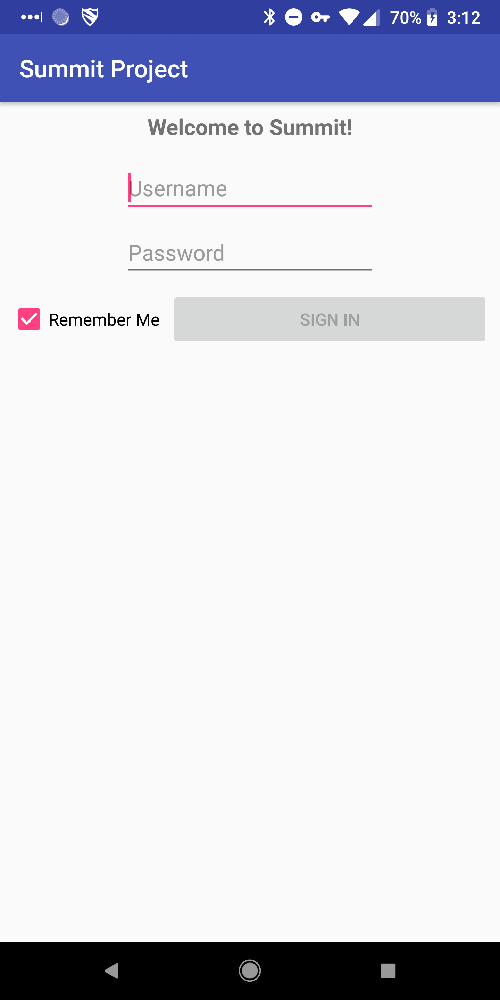
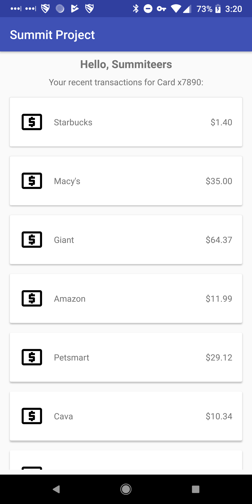

# Software Engineering Summit - Android Workshop
Welcome to the code repo for the Android workshop for Capital One's Software Engineering Summit!

In this workshop, you will learn a basic Android app featuring a login screen which
leads to an "account summary" screen which displays the user's name and the recent transactions
for one of their cards.

 . 

The resulting app will feature the following:
- A two Activity app, with data passed from the first to the second.
- UI layout using [ConstraintLayout](https://developer.android.com/training/constraint-layout/)
- Local data storage for user credentials using [SharedPreferences](https://developer.android.com/reference/android/content/SharedPreferences)
- Rendering a list using a [RecyclerView](https://developer.android.com/guide/topics/ui/layout/recyclerview)
- Real networking & JSON parsing for login

# Getting Started
- Open `workshop-starter` in Android Studio and run the project on a [physical device or emulator](https://developer.android.com/training/basics/firstapp/running-app)!
- You can also open `workshop-completed` in Android Studio if you'd like to see project after we're finished!

# Step-by-Step Instructions
See the [Step-by-Step Instructions](instructions/README.md) for a full written version of the workshop, including code, screenshots, and helpful links!
