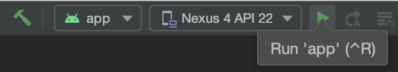
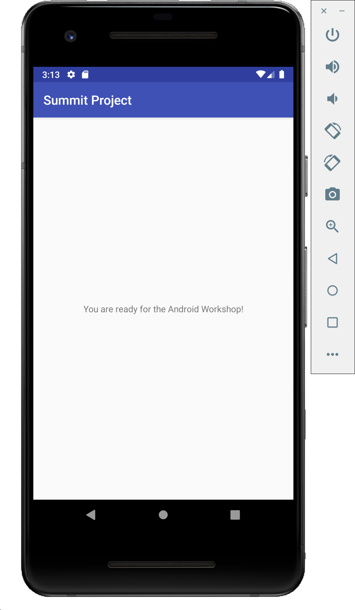
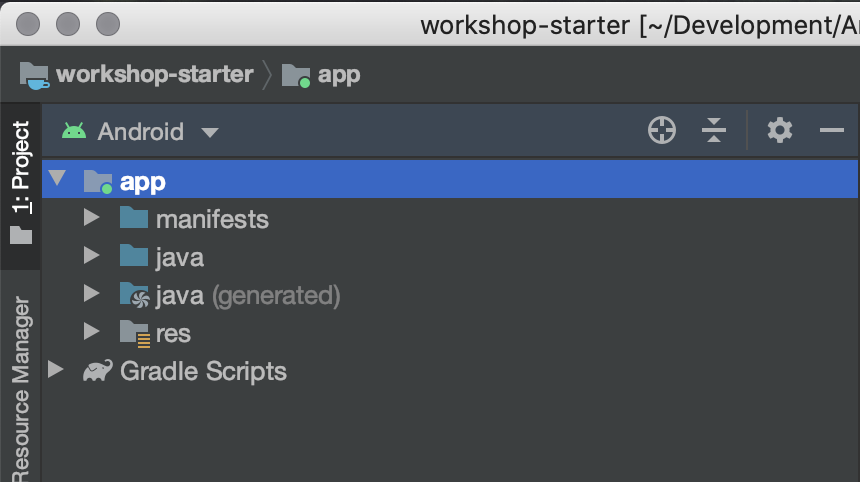
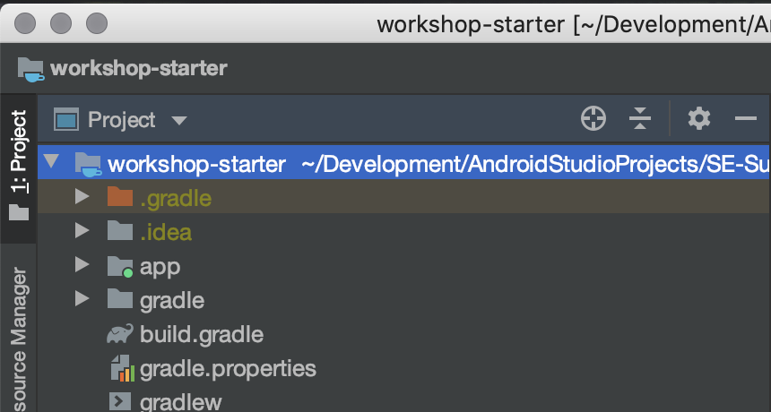
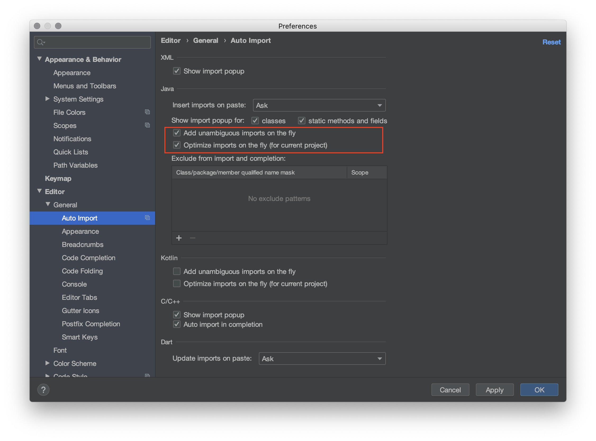

# Setup
This section covers Project Setup (mainly the same as the prereqs) and initial
IDE settings that I like to use for the workshop.

- [Project Setup](#project-setup)
- [IDE Setup](#ide-setup)

## Project Setup
You will need to set up your Android development environment and import the `workshop-starter`
project into the Android Studio IDE.
- Install [Android Studio](https://developer.android.com/studio/).
- Import `workshop-starter` into Android Studio with `File -> Open`.
- Run the project on a [physical device or emulator](https://developer.android.com/training/basics/firstapp/running-app).

If you already have Android Studio installed, make sure it is updated to version
3.6 or higher and that you have the SDK Platform `Android 10.0 (Q)` installed.

## IDE Setup
I generally like to change the filesystem view in the upper-left from `Android` to `Project`, which
reflects the same file layout as they are on disk.

I'd also recommend enabling auto-imports, which will automatically add the `import ...`
lines at the top of your code files as you write code.
- Open the `Preferences` (`Settings` on Windows) -> `Editor -> General -> Auto-Import`
  - Enable `Add unambiguous imports...` and `Optimize imports...`

[Back to Index](../README.md)
