## Login Screen UI
This section covers building the login screen's UI. In Android, UIs are written in XML directly or by using a visual editor.

- [Layout Editor](#layout-editor)
- [Learning ConstriantLayout](#learning-constriantlayout)
- [Setting Attributes](#setting-attributes)
- [Placing the Username Field](#placing-the-username-field)
- [Placing the Password Field](#placing-the-password-field)
- [Viewing the XML Representation](#viewing-the-xml-representation)
- [Placing the Sign In Button](#placing-the-sign-in-button)
- [Placing the Progress Bar](#placing-the-progress-bar)
- [Initial UI Complete!](#initial-ui-complete)

### Layout Editor

[Official Docs - Writing Layouts](https://developer.android.com/guide/topics/ui/declaring-layout)

[Official Docs - Using the Layout Editor](https://developer.android.com/studio/write/layout-editor)

In Android, we compose _Views_ (text labels, input fields, buttons, etc.) into a
_Layout_ which determines placement on the screen (stacked horizontally, vertically, on top of each other, etc.)

Our login screen's UI will go into `app/src/main/res/layout/activity_login.xml` (the file has already been created). In general, all **res**ources
for an Android app goes under `app/src/main/res/`, this includes XML layout files, but also things like images, colors, and sound files.

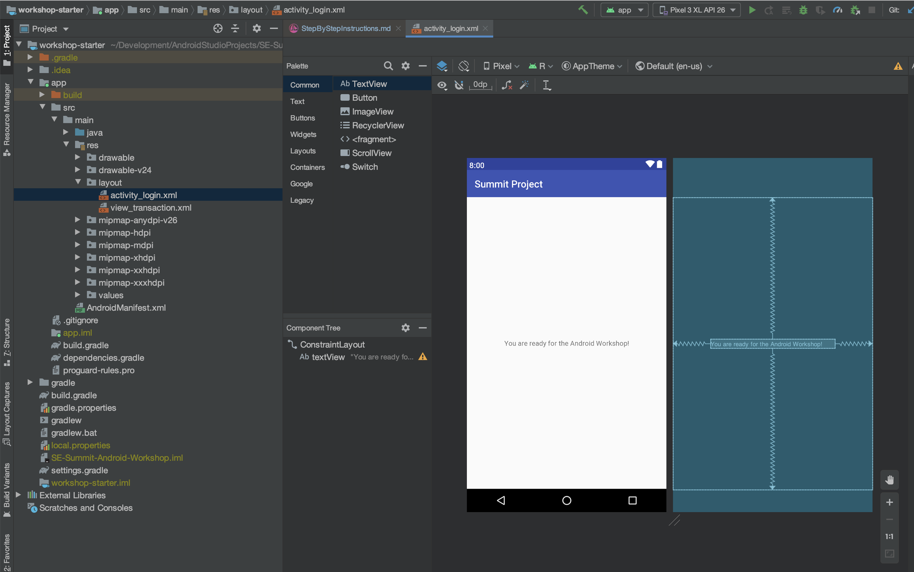

If they are not showing, you can enable the previews for the bottom bar and the top app bar by clicking the eye icon and enabling `Layout Decorations`.

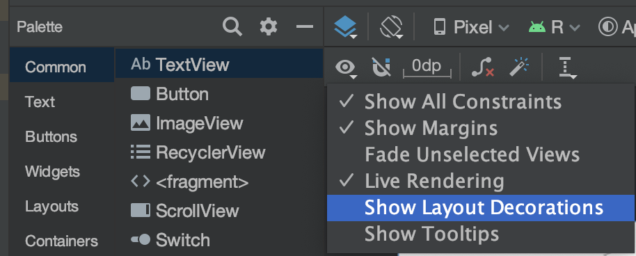

We can also look at the different components of the layout editor:

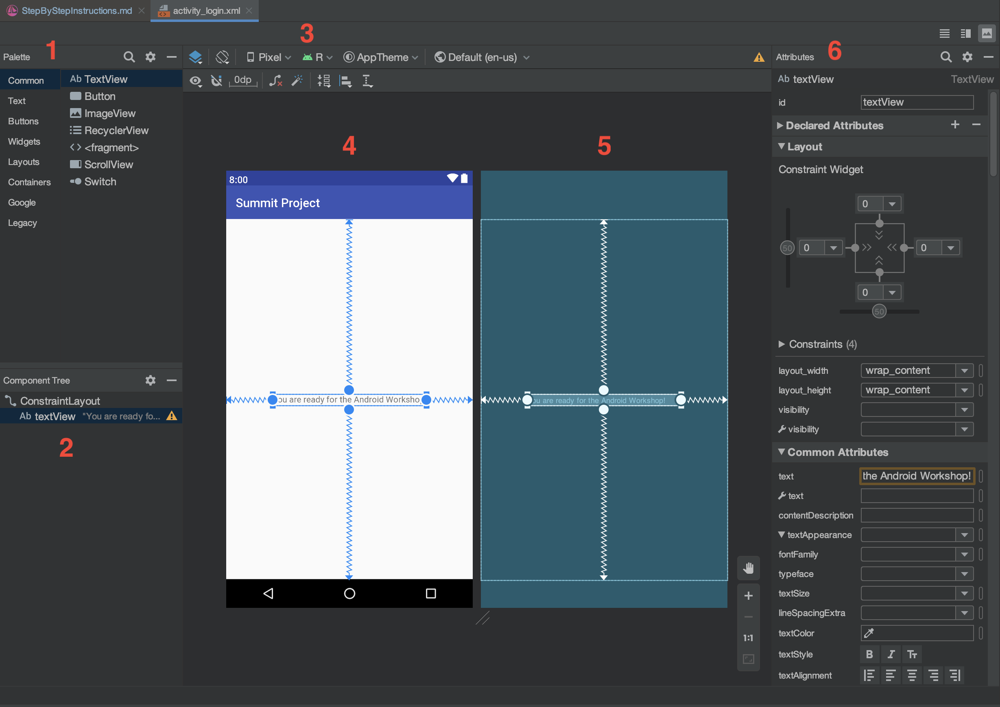

1. A `View` palette - components we can use to build your UI with.
2. The `Component Tree` - a visual hierarchy of the _Layouts_ and _Views_ in our UI.
3. Various settings we can configure on the UI preview (screen size, device, Android version, theme, etc.).
4. A preview of all visible components.
5. A wireframe preview of all components (e.g. will also show initially invisible items, like loading spinners)
6. The `Attributes` panel - shows detailed information about the currently selected item.

### Learning ConstriantLayout
We're going to use a [ConstraintLayout](https://developer.android.com/training/constraint-layout) to design our login screen.
A `ConstraintLayout` works by defining relationships (constraints) between items on the screen (in
this case, a title label, two input text fields, a button, and a loading spinner). There are other layouts which exist,
like the [LinearLayout](https://developer.android.com/guide/topics/ui/layout/linear) which simply places components in a list either horizontally or vertically (and you can nest `LinearLayout`s
inside of each other to create more complex UIs). The `ConstraintLayout` requires a little bit of a learning curve,
but can be used to create more-complex UIs with ease if used correctly.

As shown in the `Component Tree` panel, our UI _already_ has a `ConstraintLayout` which contains the
single, centered text label (called a `TextView`).

Let's see this in action by first **deleting** the existing `TextView`, by selecting it and hitting Delete / Backspace.

Then, we'll place our own `TextView` by dragging one off the palette and dropping it in the canvas.


Select the new `TextView`. When using a `ConstraintLayout`, any of its child `View`s will get four draggable handles (anchors)
used to constrain each of the four sides.

Each `View` in a `ConstraintLayout` is **required** to have at least 1 horizontal and 1 vertical constraint,
otherwise, it will default to snapping to the top-left corner, which you can see by running the app, since we have not set any constraints.

(the Layout Editor may not show it snapped to the top-left corner, but this is just for convenience during UI design)

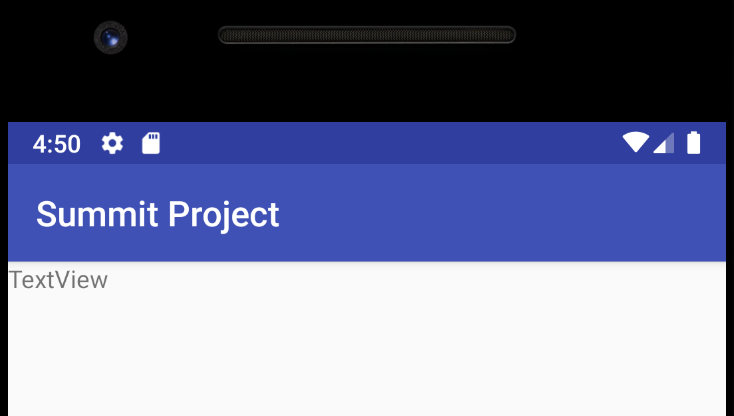

You can click-and-drag the anchors to align it to the sides of the screen, or even to other `View`s once we
have more than one. We can see this by playing in the layout editor.

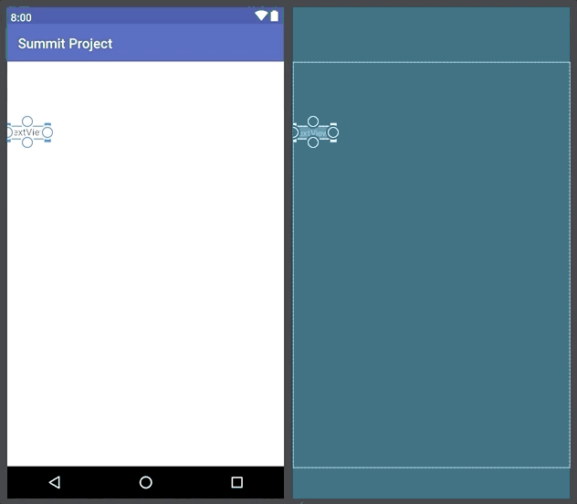

If you set **opposing constraints** (e.g. left and right, or top and bottom), the `View` will center itself between the two.

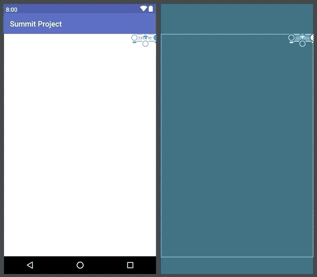

We would like this `TextView` to be centered at the top of our screen, to become a title later, so we only
need to set the **top**, **left**, and **right** constraint.

The bottom constraint is not needed: to delete a constraint, Cmd+Click (or Ctrl+Click) on the anchor. Deletion is also an option if
you right-click on the anchor.

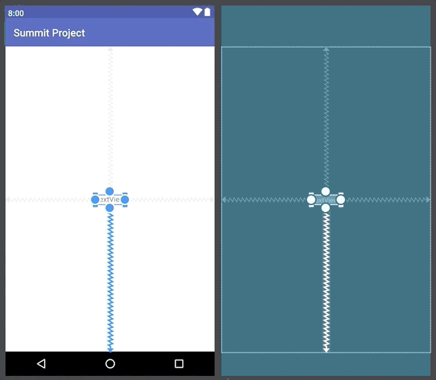

### Setting Attributes

With our `TextView` in the right position, we can set some of its attributes in the right panel:
- Set the `id` to `title`
- Use the `Constraint Widget` to set a top margin of `8`
- Set the `text` to `Welcome to Summit!`
- Set the `textSize` to `18sp`
- Click the bold `B` under `textStyle`


The `id` is like a "variable name" for the UI element. It has no visual impact, but will be needed later to reference this `View` from code.

Units-of-measurement in Android are not necessarily pixels. Smartphones come in different sizes and _pixel densities_ (how many pixels
comprise the screen). e.g. two Android phones may have the same screen size (say, in inches), but have different pixel densities. So, it's important
to not use pixels for measurement, as your UI would end up looking differently on different screens.

Android provides two primary units-of-measurement that address this concern:
  - _Density-independent pixels_ (dp). Android will figure out how much to scale this value by depending on the screen size (so it looks the same on all devices).  e.g. This might be 8 _pixels_ on a smaller screen vs. 16 _pixels_ on a larger screen.
    - For example, our title's top margin is set using dp.
  - _Scalable pixels_ (sp). This is similar to the (dp), except it also considers the user's system-wide font size (e.g. a user may prefer larger text).
    - For example, our title's text size is set using sp.

[Official Docs - Support Different Screen Sizes](https://developer.android.com/training/multiscreen/screendensities)

### Placing the Username Field
In the palette, go to the `Text` section and drag-and-drop a `Plain Text` component onto the canvas. This
is an `EditText` view and is a text field that the user can type into.

We want it to be centered, but _below_ our title view. The left & right constraints will be set to the sides
of the device. The top constraint will be linked to the **bottom** anchor of the title view.


For attributes:
- Set the `id` to `username`
- Use the `Constraint Widget` to set a top margin of `16` and left & right margins of `8`
- Set the `text` to `Username`


Run the app. Notice how the user has to delete the word "Username" in order to type their name, which is inconvenient.

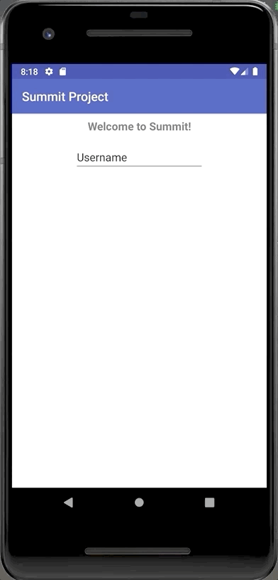

Instead of setting the `text` attribute, set the `hint` attribute, which sets the text on the background
of the `EditText`, until the user types anything.


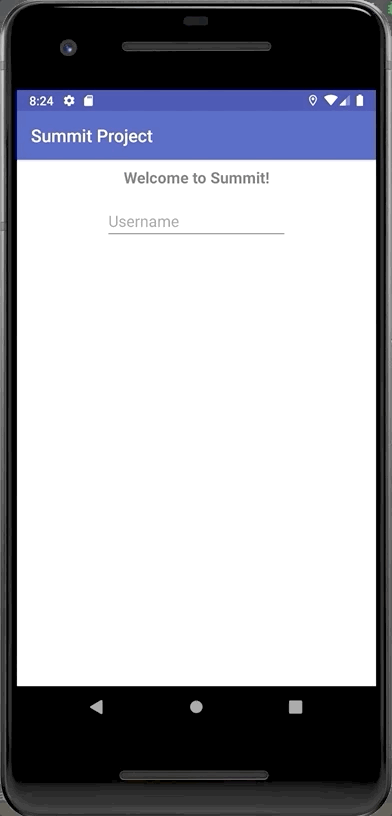

### Placing the Password Field
In the palette, drag a `Password` component under the `Text` section.

Constrain it under the username field, similar to how the username was done, except constrain the top
side to the bottom anchor of the username field.

For attributes:
- Set the `id` to `password`
- Use the `Constraint Widget` to set top, left, and right sides to `8`
- Set the `hint` to `Password`

### Viewing the XML Representation
For everything we've been doing in the Layout Editor, XML code is generated underneath.

You can view it by clicking the Code button above the Attributes panel. You can also click the Design
button in this area to go back.


We can see that the XML representation is roughly understandable, based on what we did in the
Layout Editor. It's possible to design your layout fully by writing this XML code directly and this is
up to personal preference. I generally use both the Layout Editor and XML directly -- for example,
some UI attributes are easier to just type out in XML rather than finding them in the Attributes panel.

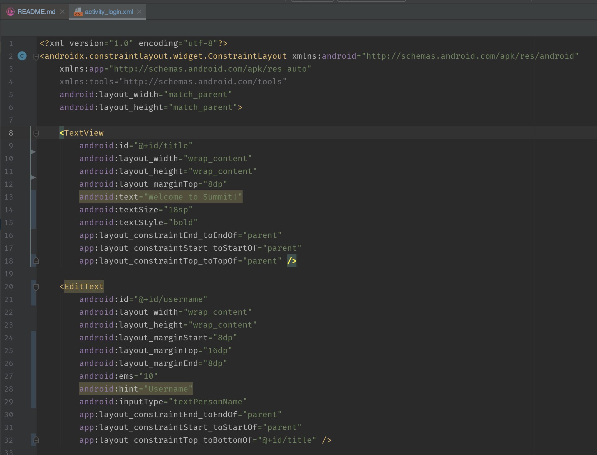

Some of the lines are highlighted yellow as warnings, we'll address these in a later section.

Make sure you click the Design button to go back to the Layout Editor.

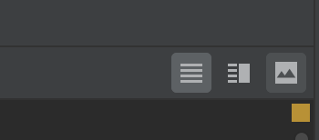

### Placing the Sign In Button
We'll place a `Button` component next (under `Buttons` in the palette). We'll set the
constraints similar to how we did the last two (but below the password field).

For attributes:
- Set the `id` to `sign_in`
- Use the `Constraint Widget` to set top to `8` and the left & right sides to `16`
- Set the `text` to `Sign In`

To get the width of the bottom to expand to fill the available space, choose `0dp (match_constraint)` for the `layout_width`.
The button will expand to fill the available space, minus the margins.

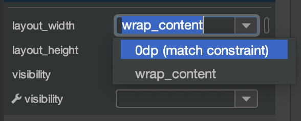

### Placing the Progress Bar
Finally, we'll place a `ProgressBar` (under `Widgets` in the palette) and constrain it below the button.

For attributes:
- We can leave the `id` alone, the default `progressBar` is adequate
- Use the `Constraint Widget` to set top to `8`

We want the progress bar to be initially invisible, to do this set the `visibility` attribute to `invisible`

There's also `gone` as an option. The difference between `invisible` and `gone` is whether or not the view's
bounding box will still be kept. This might be relevant if other items are being constrained to your `ProgressBar`
and you do (or don't) want them to be shifted accordingly.


### Initial UI Complete!
This completes our initial UI for the login screen!

There are a few improvements we'll come back and add later -- adding a "Remember Me"
switch and addressing some of the XML warnings.

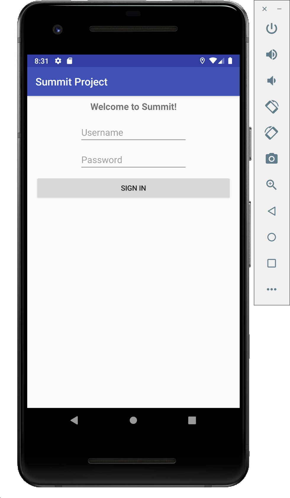

Here's the final XML code for this screen. If you've fallen behind or missed something, you
can copy paste this into the Code section of the `activity_login.xml` screeen.


```xml
<?xml version="1.0" encoding="utf-8"?>
<androidx.constraintlayout.widget.ConstraintLayout xmlns:android="http://schemas.android.com/apk/res/android"
    xmlns:app="http://schemas.android.com/apk/res-auto"
    xmlns:tools="http://schemas.android.com/tools"
    android:layout_width="match_parent"
    android:layout_height="match_parent">

    <TextView
        android:id="@+id/title"
        android:layout_width="wrap_content"
        android:layout_height="wrap_content"
        android:layout_marginTop="8dp"
        android:text="Welcome to Summit!"
        android:textSize="18sp"
        android:textStyle="bold"
        app:layout_constraintEnd_toEndOf="parent"
        app:layout_constraintStart_toStartOf="parent"
        app:layout_constraintTop_toTopOf="parent" />

    <EditText
        android:id="@+id/username"
        android:layout_width="wrap_content"
        android:layout_height="wrap_content"
        android:layout_marginStart="8dp"
        android:layout_marginTop="16dp"
        android:layout_marginEnd="8dp"
        android:ems="10"
        android:hint="Username"
        android:inputType="textPersonName"
        app:layout_constraintEnd_toEndOf="parent"
        app:layout_constraintStart_toStartOf="parent"
        app:layout_constraintTop_toBottomOf="@+id/title" />

    <EditText
        android:id="@+id/password"
        android:layout_width="wrap_content"
        android:layout_height="wrap_content"
        android:layout_marginStart="8dp"
        android:layout_marginTop="8dp"
        android:layout_marginEnd="8dp"
        android:ems="10"
        android:hint="Password"
        android:inputType="textPassword"
        app:layout_constraintEnd_toEndOf="parent"
        app:layout_constraintStart_toStartOf="parent"
        app:layout_constraintTop_toBottomOf="@+id/username" />

    <Button
        android:id="@+id/sign_in"
        android:layout_width="0dp"
        android:layout_height="wrap_content"
        android:layout_marginStart="16dp"
        android:layout_marginTop="8dp"
        android:layout_marginEnd="16dp"
        android:text="Sign In"
        app:layout_constraintEnd_toEndOf="parent"
        app:layout_constraintStart_toStartOf="parent"
        app:layout_constraintTop_toBottomOf="@+id/password" />

    <ProgressBar
        android:id="@+id/progressBar"
        style="?android:attr/progressBarStyle"
        android:layout_width="wrap_content"
        android:layout_height="wrap_content"
        android:layout_marginTop="8dp"
        android:visibility="invisible"
        app:layout_constraintEnd_toEndOf="parent"
        app:layout_constraintStart_toStartOf="parent"
        app:layout_constraintTop_toBottomOf="@+id/sign_in" />
    
</androidx.constraintlayout.widget.ConstraintLayout>
```

[Back to Index](../README.md)
