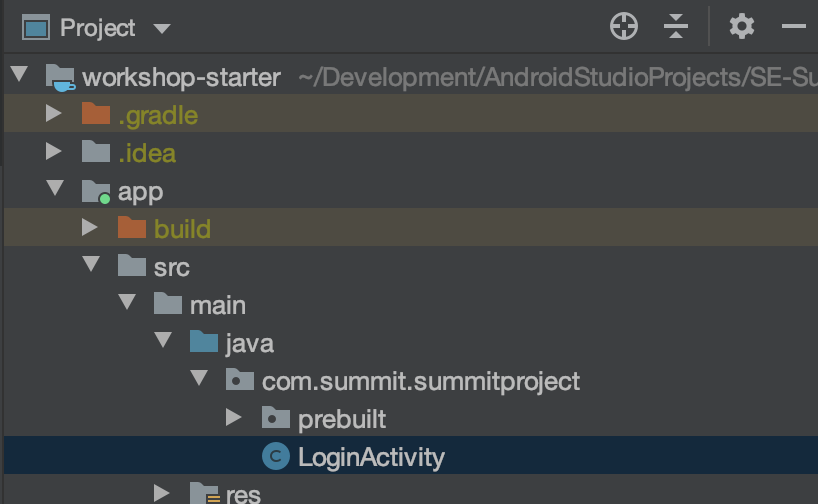
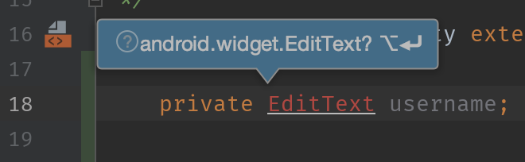
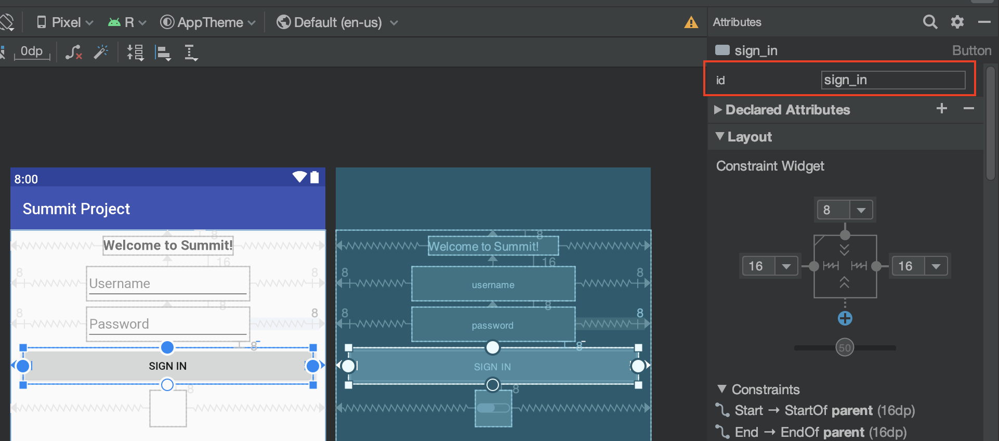
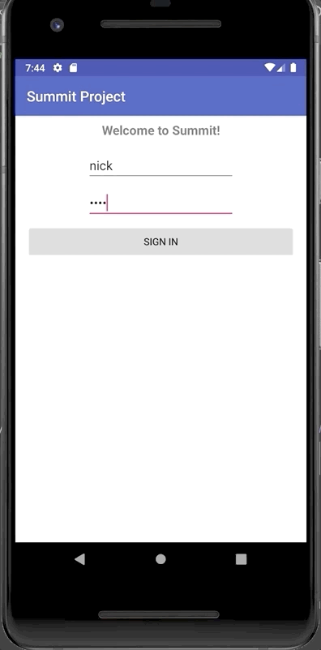

# Login Screen Code
This section covers adding behaviors to our login screen by writing Java code:
- Disable the "Sign In" button unless a username & password are entered.
- Show a simple popup message when the button is pressed.

All behavioral logic is written in actual code, like Java.

The next section will cover actually hooking the Sign In button up to some network
calls to actually do a "real" login.

- [Code Setup](#code-setup)
- [Disabling the Sign In Button](#disabling-the-sign-in-button)
- [Button Click Functionality](#button-click-functionality)
- [Initial Code Complete!](#initial-code-complete)

### Code Setup
Application code goes under `app/src/main/java`. For this login screen specifically,
this will go into `app/src/main/java/com.summit.summitproject/LoginActivity`.



Broadly speaking, "screens" in Android are called "activities" and the `onCreate` method
of an `Activity` is called when the screen is about to be shown for the first time to the user,
so you'll generally find that it's used to set up initialization and behavioral logic for the screen.

We're going to need references to our username, password, button, and progress bar components, so we'll
define them as member variables on the object. There's also the title, but we won't need to do anything with it.

```java
public class LoginActivity extends AppCompatActivity {
    private EditText username;
    private EditText password;
    private Button signIn;
    private ProgressBar progress;
```

If any of the types show up red, you'll need to do a `import`. Put your cursor on the text and use the key command to add the import
to the file.

Also check the `Setup` section of the instructions to see how to set automatic imports up.



Inside of `onCreate` we see a call to `setContentView`:
```java
    setContentView(R.layout.activity_login);
```

This method call tells Android which layout file to display for this screen. You can think of the `R.layout.activity_login` as
short for "Resources -> layout -> activity_login.xml".

It's only **after** the layout has been specified that we can assign (bind) our `View` variables. Use `findViewById` to
assign the variables to the UI components in the layout. As a parameter, it takes the view's ID that it was given in XML.

It uses a similar `R.id.` syntax, where the ID you use is the one set in the `id` field in XML. For example, our
Sign In button had an ID of `sign_in` in XML, so we pass `R.id.sign_in` to `findViewById`.



```java
    @Override
    public void onCreate(Bundle savedInstanceState) {
        super.onCreate(savedInstanceState);
        setContentView(R.layout.activity_login);
        
        username = findViewById(R.id.username);
        password = findViewById(R.id.password);
        signIn = findViewById(R.id.sign_in);
        progress = findViewById(R.id.progressBar);
    }
 ```

### Disabling the Sign In Button
Our first goal is to disable our Sign In button unless text has been inputted into both the
username and password fields.

We can programmatically control the behavior of the UI by interacting with the variables we've set.

For example, we can initially disable our Sign In button by calling:
```java
    signIn.setEnabled(false);
```

What we'd like to do is have a small bit of code run every time the user types in either the
username or password fields to determine if the button should be enabled or not.

We can achieve this by setting [TextWatcher](https://developer.android.com/reference/android/text/TextWatcher)s on our `username` and `password` variables.

A `TextWatcher` is an `interface` that an `EditText` can call each time the user types a character. An object which implements this interface
receives callbacks (e.g. methods are called automatically) before and after the newly typed character is displayed on the UI.

There are a few ways to implement an `interface` in Java. In this case, let's create a shared object / variable which implements
the `TextWatcher` interface that will be used for both the `username` and `password` fields.

Below the `onCreate` method, we'll create a new `TextWatcher` variable to directly implement the interface (called an anonymous class):
```java
    private TextWatcher textWatcher = new TextWatcher() {
        @Override
        public void beforeTextChanged(CharSequence s, int start, int count, int after) {
            // Unused
        }

        @Override
        public void onTextChanged(CharSequence s, int start, int before, int count) {
            
        }

        @Override
        public void afterTextChanged(Editable s) {
            // Unused
        }
    };
```

We're only going to use `onTextChanged` method, which is the generic "some text has changed" callback, but any of the three methods would do.

We can get the text from the `username` & `password` by calling `.getText().toString()`. The `toString()` is required here because
`getText()` returns an [Editable](https://developer.android.com/reference/android/text/Editable) (not a `String`). The `Editable` is a mutable
character array, which is more efficient than using a (immutable) `String` to represent character data that changes frequently (in this case, every time the user types).

We can check if both strings are non-empty to decide to enable our button or not:
```java
    @Override
    public void afterTextChanged(Editable s) {
        String inputtedUsername = username.getText().toString();
        String inputtedPassword = password.getText().toString();
        boolean enableButton = inputtedUsername.length() > 0 && inputtedPassword.length() > 0;

        signIn.setEnabled(enableButton);
    }
````

Finally, we need to set our new `textWatcher` variable on our two `username` & `password` variables for it to take effect.

This can go in `onCreate`:
```
    username.addTextChangedListener(textWatcher);
    password.addTextChangedListener(textWatcher);
```

And test it!


Here's the code so far for the `LoginActivity`:
```java
public class LoginActivity extends AppCompatActivity {
    private EditText username;
    private EditText password;
    private Button signIn;
    private ProgressBar progress;

    @Override
    public void onCreate(Bundle savedInstanceState) {
        super.onCreate(savedInstanceState);
        setContentView(R.layout.activity_login);

        username = findViewById(R.id.username);
        password = findViewById(R.id.password);
        signIn = findViewById(R.id.sign_in);
        progress = findViewById(R.id.progressBar);

        signIn.setEnabled(false);

        username.addTextChangedListener(textWatcher);
        password.addTextChangedListener(textWatcher);
    }

    private TextWatcher textWatcher = new TextWatcher() {
        @Override
        public void beforeTextChanged(CharSequence s, int start, int count, int after) {}

        @Override
        public void onTextChanged(CharSequence s, int start, int before, int count) {}

        @Override
        public void afterTextChanged(Editable s) {
            String inputtedUsername = username.getText().toString();
            String inputtedPassword = password.getText().toString();
            boolean enableButton = inputtedUsername.length() > 0 && inputtedPassword.length() > 0;

            signIn.setEnabled(enableButton);
        }
    };
}
```

### Button Click Functionality
The `TextWatcher` allows us to receive events (method callbacks) as the user types in the username & password fields.

There's also a similar interface we can implement to receive callbacks when the user taps on the Sign In button (when it's enabled)
-- the [OnClickListener](https://developer.android.com/reference/android/view/View.OnClickListener). Unlike the `TextWatcher`, only one
method has to be implemented: `onClick` (e.g. what code do you want to run when the user taps on the button).

We won't need a separate variable for our `OnClickListener`, since we'll only use it for our single button. So, we can define it
and set it in the same expression:
```
    username.addTextChangedListener(textWatcher);
    password.addTextChangedListener(textWatcher);
    
    signIn.setOnClickListener(new View.OnClickListener() {
        @Override
        public void onClick(View v) {
            // Do something when the button is clicked
        }
    });
```

We can show a small popup (called a `Toast`). Use `Toast.makeText` to create one. It takes three parameters:
- A [Context](https://developer.android.com/reference/android/content/Context) - an abstract reference to the Android system. All activities (like our `LoginActivity`) are `Context`s.
- The `String` you want to display in the popup.
- How long to display the popup. There are two constants we can use - `Toast.LENGTH_SHORT` and `Toast.LENGTH_LONG`

When your `Toast` is built, you need to call `show()` for it to be displayed:
```java
    signIn.setOnClickListener(new View.OnClickListener() {
        @Override
        public void onClick(View v) {
            Toast toast = Toast.makeText(LoginActivity.this, "Sign In Clicked", Toast.LENGTH_LONG);
            toast.show();
        }
    });
```



## Initial Code Complete!
Next, we'll look into adding some networking behind our Sign In button.

Here's the full code for the `LoginActivity.java` so far:
```java
package com.summit.summitproject;

import android.os.Bundle;
import android.text.Editable;
import android.text.TextWatcher;
import android.view.View;
import android.widget.Button;
import android.widget.EditText;
import android.widget.ProgressBar;
import android.widget.Toast;

import androidx.appcompat.app.AppCompatActivity;

import com.summit.summitproject.prebuilt.login.LoginManager;

public class LoginActivity extends AppCompatActivity {
    private EditText username;
    private EditText password;
    private Button signIn;
    private ProgressBar progress;

    @Override
    public void onCreate(Bundle savedInstanceState) {
        super.onCreate(savedInstanceState);
        setContentView(R.layout.activity_login);

        username = findViewById(R.id.username);
        password = findViewById(R.id.password);
        signIn = findViewById(R.id.sign_in);
        progress = findViewById(R.id.progressBar);

        signIn.setEnabled(false);

        username.addTextChangedListener(textWatcher);
        password.addTextChangedListener(textWatcher);

        signIn.setOnClickListener(new View.OnClickListener() {
            @Override
            public void onClick(View v) {
                Toast toast = Toast.makeText(LoginActivity.this, "Sign In Clicked", Toast.LENGTH_LONG);
                toast.show();
            }
        });
    }

    private TextWatcher textWatcher = new TextWatcher() {
        @Override
        public void beforeTextChanged(CharSequence s, int start, int count, int after) {}

        @Override
        public void onTextChanged(CharSequence s, int start, int before, int count) {}

        @Override
        public void afterTextChanged(Editable s) {
            String inputtedUsername = username.getText().toString();
            String inputtedPassword = password.getText().toString();
            boolean enableButton = inputtedUsername.length() > 0 && inputtedPassword.length() > 0;

            signIn.setEnabled(enableButton);
        }
    };

}
```

[Back to Index](../README.md)
