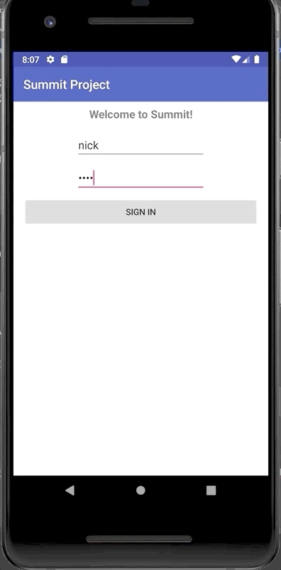
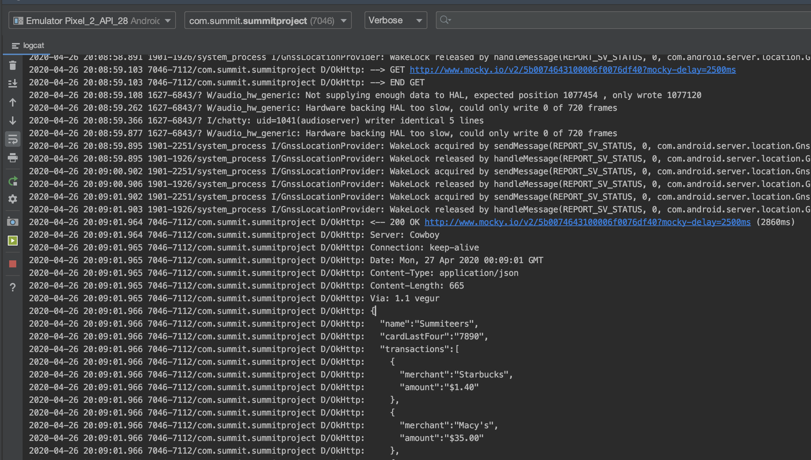

# Login Networking
This section covers implementing very simple networking using a prebuilt `LoginManager`
class.

- [Simple Networking](#simple-networking)

## Simple Networking
We're going to use the prebuilt `LoginManager` class for networking, which is usually
a large topic / workshop on its own as it involves the topics of threading, REST,
and JSON parsing.

If you'd like to learn this from the ground, here are some helpful links:
- [Understanding REST](https://mlsdev.com/blog/81-a-beginner-s-tutorial-for-understanding-restful-api)
- [OkHttp & Parsing](https://www.journaldev.com/13629/okhttp-android-example-tutorial)
  - [OkHttp](https://square.github.io/okhttp/) is a convenient networking library for Android.

The prebuilt `LoginManager` makes an network call to a fake endpoint to "log the user in" and retrieve
a list of recent transactions for a single credit card.

The `Transaction` class is also prebuilt as is a simple data class which contains a
merchant's name and the transaction amount. Both of these are under the `prebuilt` package in the project.

To use it, we need to implement the `LoginListener` interface and create and use the
`LoginManager` with it.

We'll put our `LoginListener` code in a separate variable like our `TextWatcher`, since it
will require a larger amount of code.

`onLoginSuccess` is called if the API call succeeds and we have recent transaction information for the user.
The API also returns the user's name and the last four digits of their credit card. `onLoginError` is called
if the networking fails (for example, if the user doesn't have internet connectivity).
```java

    private LoginListener loginListener = new LoginListener() {
        @Override
        public void onLoginSuccess(String name, String cardNum, ArrayList<Transaction> transactions) {
            
        }

        @Override
        public void onLoginError(Exception exception) {

        }
    };
```

Before we fill out our `loginListener`, let's also set up our `LoginManager`, which will be called in place of our
`Toast` when the button is pressed.

Our `LoginManager` requires us to pass the typed username, password, and a `LoginListener`. After creating it, we have to
call `.execute()` for the networking to take place.
```java
    signIn.setOnClickListener(new View.OnClickListener() {
        @Override
        public void onClick(View v) {
            String inputtedUsername = username.getText().toString();
            String inputtedPassword = password.getText().toString();

            LoginManager loginManager = new LoginManager(inputtedUsername, inputtedPassword, loginListener);
            loginManager.execute();
        }
    });
```

We should also show our `ProgressBar` (by setting it to visible):
```java
    signIn.setOnClickListener(new View.OnClickListener() {
        @Override
        public void onClick(View v) {
            String inputtedUsername = username.getText().toString();
            String inputtedPassword = password.getText().toString();
            
            progress.setVisibility(View.VISIBLE);

            LoginManager loginManager = new LoginManager(inputtedUsername, inputtedPassword, loginListener);
            loginManager.execute();
        }
    });
```

To finish out our `LoginListener`, let's show a simple `Toast` in either the `success` or `error` scenarios. We also
need to hide our `ProgressBar`.
```java
    private LoginListener loginListener = new LoginListener() {
        @Override
        public void onLoginSuccess(String name, String cardNum, ArrayList<Transaction> transactions) {
            progress.setVisibility(View.INVISIBLE);
            Toast toast = Toast.makeText(LoginActivity.this, "Logged in as: " + name, Toast.LENGTH_LONG);
            toast.show();
        }

        @Override
        public void onLoginError(Exception exception) {
            progress.setVisibility(View.INVISIBLE);
            Toast toast = Toast.makeText(LoginActivity.this, "Logged failed: " + exception.toString(), Toast.LENGTH_LONG);
            toast.show();
        }
    };
```

We can test it out by clicking the button:



You can also click the `Logcat` tab at the bottom of Android Studio to see the network call:



Here's the full code for the `LoginActivity.java` so far:
```java
package com.summit.summitproject;

import android.os.Bundle;
import android.text.Editable;
import android.text.TextWatcher;
import android.view.View;
import android.widget.Button;
import android.widget.EditText;
import android.widget.ProgressBar;
import android.widget.Toast;

import androidx.appcompat.app.AppCompatActivity;

import com.summit.summitproject.prebuilt.login.LoginListener;
import com.summit.summitproject.prebuilt.login.LoginManager;
import com.summit.summitproject.prebuilt.model.Transaction;

import java.util.ArrayList;

public class LoginActivity extends AppCompatActivity {

    private EditText username;

    private EditText password;

    private Button signIn;

    private ProgressBar progress;

    @Override
    public void onCreate(Bundle savedInstanceState) {
        super.onCreate(savedInstanceState);
        setContentView(R.layout.activity_login);

        username = findViewById(R.id.username);
        password = findViewById(R.id.password);
        signIn = findViewById(R.id.sign_in);
        progress = findViewById(R.id.progressBar);

        signIn.setEnabled(false);

        username.addTextChangedListener(textWatcher);
        password.addTextChangedListener(textWatcher);

        signIn.setOnClickListener(new View.OnClickListener() {
            @Override
            public void onClick(View v) {
                String inputtedUsername = username.getText().toString();
                String inputtedPassword = password.getText().toString();

                progress.setVisibility(View.VISIBLE);

                LoginManager loginManager = new LoginManager(inputtedUsername, inputtedPassword, loginListener);
                loginManager.execute();
            }
        });
    }

    private TextWatcher textWatcher = new TextWatcher() {
        @Override
        public void beforeTextChanged(CharSequence s, int start, int count, int after) {}

        @Override
        public void onTextChanged(CharSequence s, int start, int before, int count) {}

        @Override
        public void afterTextChanged(Editable s) {
            String inputtedUsername = username.getText().toString();
            String inputtedPassword = password.getText().toString();
            boolean enableButton = inputtedUsername.length() > 0 && inputtedPassword.length() > 0;

            signIn.setEnabled(enableButton);
        }
    };

    private LoginListener loginListener = new LoginListener() {
        @Override
        public void onLoginSuccess(String name, String cardNum, ArrayList<Transaction> transactions) {
            progress.setVisibility(View.INVISIBLE);
            Toast toast = Toast.makeText(LoginActivity.this, "Logged in as: " + name, Toast.LENGTH_LONG);
            toast.show();
        }

        @Override
        public void onLoginError(Exception exception) {
            progress.setVisibility(View.INVISIBLE);
            Toast toast = Toast.makeText(LoginActivity.this, "Logged failed: " + exception.toString(), Toast.LENGTH_LONG);
            toast.show();
        }
    };
}
```

[Back to Index](../README.md)
