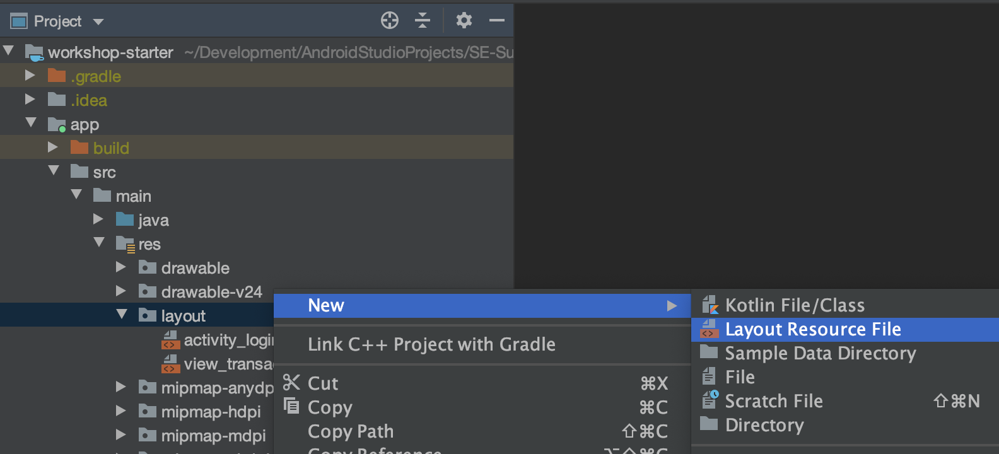
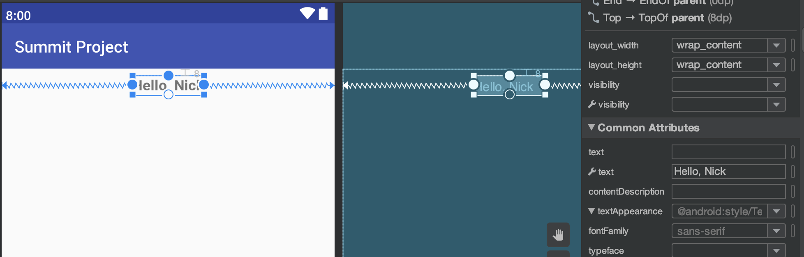
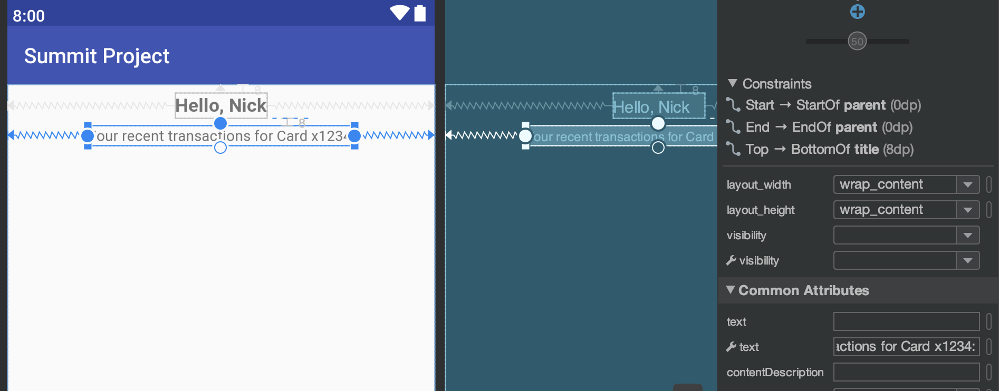
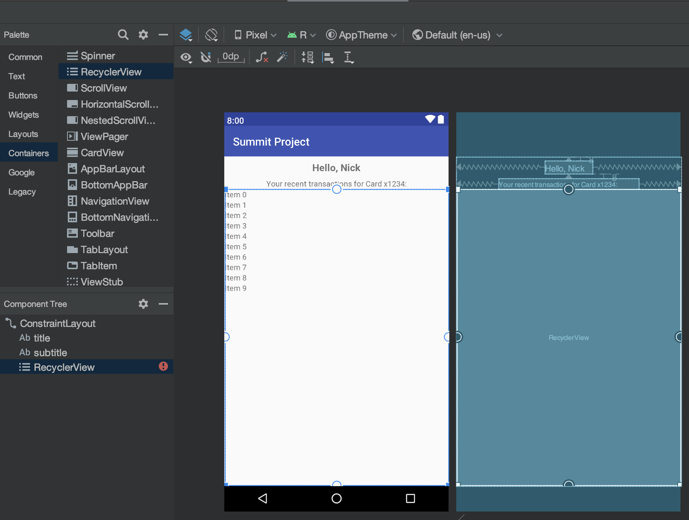
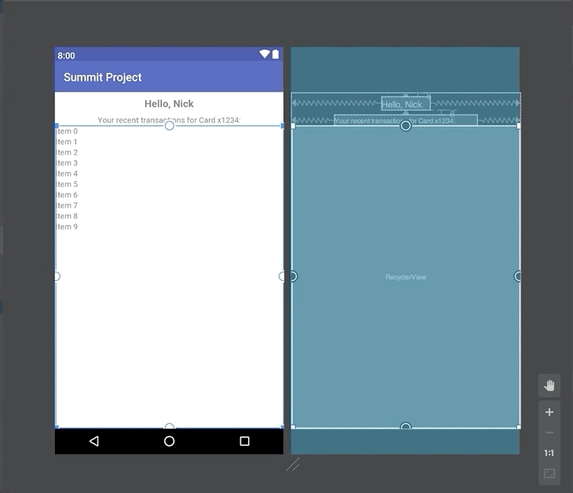
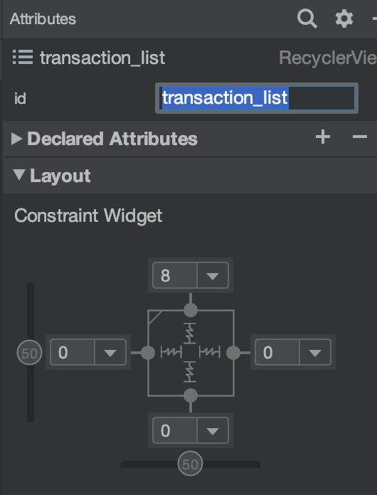
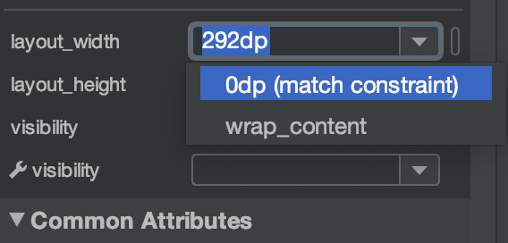

# Summary Screen UI
This section covers building the XML Layout for the Transactions Summary screen.

- [Layout Creation](#layout-creation)

## Layout Creation
We'll need to create a new XML layout file `activity_summary` under
`app/src/main/res/layout/`.



Use two `TextView`s to create the title and the subtitle for this screen, this
will be done similar to the Login UI. The title will be used to display the user's name
and the subtitle will display their credit card's last four digits (both pieces of information
are sent back from the server in our networking from the last section).

The title will be have its top, left, and right constraints set to the sides
of the screen and will have the following attributes:
- Set the `id` to `title`
- Use the `Constraint Widget` to set a top margin of `8`
- Set the `textSize` to `18sp`
- Click the bold `B` under `textStyle`

Interestingly, we can't set the `text` attribute, because we _don't know_ what the full text should be,
since it's based on what is returned from our network call. So, it will have to be set via Java code.

Instead, we can set the `text` attribute _with the wrench icon next to it_. This sets it as a "preview" only -
e.g. when we run the app, it will still use the "non-wrench" `text` (which is blank). However, it's useful to
set the text preview while doing UI design.



The subtitle will be have its left & right constraints set to the sides
of the screen and the top constraint set to the `title`'s bottom anchor.

It will have the following attributes:
- Set the `id` to `subtitle`
- Use the `Constraint Widget` to set a top margin of `8`
- Set the `text` with wrench to `Your recent transactions for Card x1234:`



Finally, we'll create our "list" component. Normally, you need to create the
list placeholder (which we'll do next) on the screen it will be rendered on **and**
you would also create separate XML layouts for each row template. The latter has
already been done, you can see it in the `view_transaction.xml` file, but generally
that would be another XML layout file you would need to create.

All we need to do it place the list placeholder component in our activity layout. It's called
a `RecyclerView` and is under the `Containers` section of the palette.

When you drop it onto the canvas, it is initially too big to set the constraints (which we
still need to do, otherwise it will snap to the top-left corner at runtime).



You can use the blue square handles to resize and recenter the `RecyclerView` and make it easier to work with.



Then set the constraints so that it is horizontally _and vertically_ centered below the `subtitle`.


Finally, set the `layout_width` and `layout_height` attributes to `0dp (match_constraint)` in the
dropdown. This sets it up to fill the leftover space in the horizontal and vertical directions.

Also set these attibutes:
- Set the `id` to `transaction_list`
- Use the `Constraint Widget` to set a top margin of `8`





Ultimately the `RecyclerView` will end up looking like it originally did when we dropped it down, but
now it will actually render properly at runtime.

That's it for this section, here's the full XML below:
```xml
<?xml version="1.0" encoding="utf-8"?>
<androidx.constraintlayout.widget.ConstraintLayout
    xmlns:android="http://schemas.android.com/apk/res/android"
    xmlns:app="http://schemas.android.com/apk/res-auto"
    xmlns:tools="http://schemas.android.com/tools"
    android:layout_width="match_parent"
    android:layout_height="match_parent">

    <TextView
        android:id="@+id/title"
        android:layout_width="wrap_content"
        android:layout_height="wrap_content"
        android:layout_marginTop="8dp"
        android:textSize="18sp"
        android:textStyle="bold"
        app:layout_constraintEnd_toEndOf="parent"
        app:layout_constraintStart_toStartOf="parent"
        app:layout_constraintTop_toTopOf="parent"
        tools:text="Hello, Nick" />

    <TextView
        android:id="@+id/subtitle"
        android:layout_width="wrap_content"
        android:layout_height="wrap_content"
        android:layout_marginTop="8dp"
        app:layout_constraintEnd_toEndOf="parent"
        app:layout_constraintStart_toStartOf="parent"
        app:layout_constraintTop_toBottomOf="@+id/title"
        tools:text="Your recent transactions for Card x1234:" />

    <androidx.recyclerview.widget.RecyclerView
        android:id="@+id/transaction_list"
        android:layout_width="0dp"
        android:layout_height="0dp"
        android:layout_marginTop="8dp"
        app:layout_constraintBottom_toBottomOf="parent"
        app:layout_constraintEnd_toEndOf="parent"
        app:layout_constraintStart_toStartOf="parent"
        app:layout_constraintTop_toBottomOf="@+id/subtitle" />
</androidx.constraintlayout.widget.ConstraintLayout>
```

[Back to Index](../README.md)