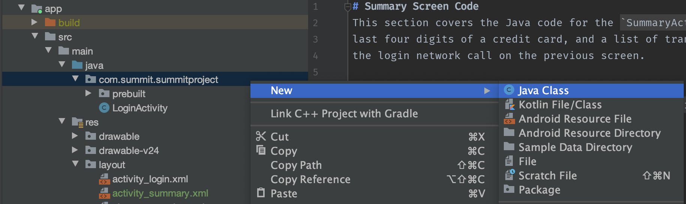
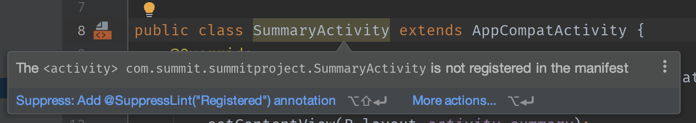
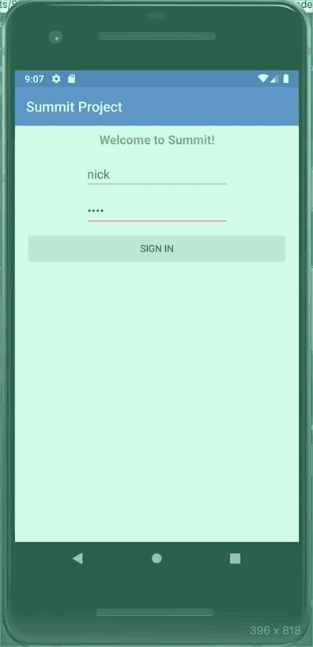
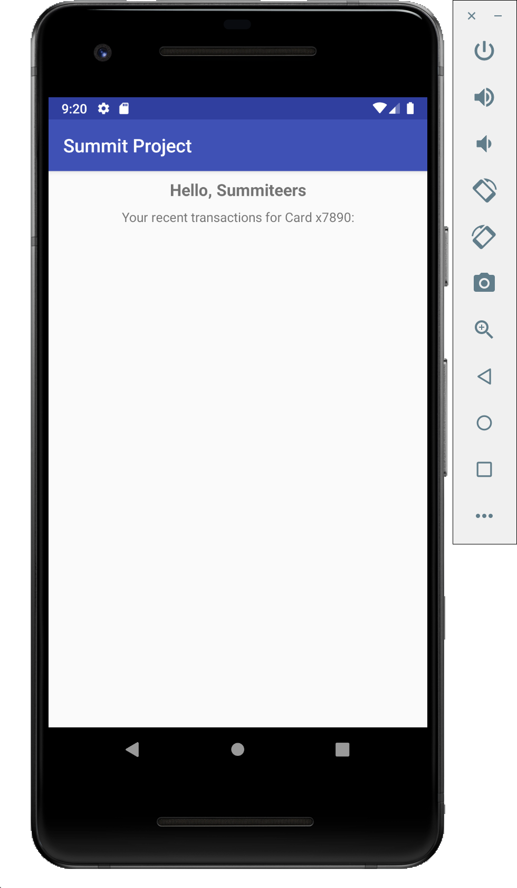
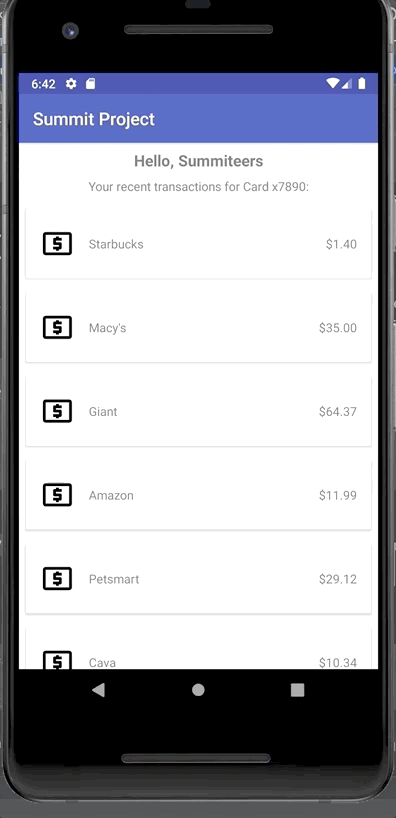

# Summary Screen Code
This section covers the Java code for the `SummaryActivity` to display the user's name,
last four digits of a credit card, and a list of transactions -- all of which is retrieved from
the login network call on the previous screen.

- [Creating a New Activity](#creating-a-new-activity)
- [Launching the Summary Activity](#launching-the-summary-activity)
- [Initializing the Summary Activity](#initializing-the-summary-activity)
- [Rendering a List](#rendering-a-list)

## Creating a New Activity
Let's create a new `Java Class` called `SummaryActivity` under `app/src/main/java/com.summit.summitproject/`. You
can leave all the default options as-is:



We need to make this class extend `AppCompatActivity` to be a true Android screen.

And we should add the `onCreate` method and call `setContentView` to set our layout for this new screen:
```java
    public class SummaryActivity extends AppCompatActivity {
        @Override
        protected void onCreate(@Nullable Bundle savedInstanceState) {
            super.onCreate(savedInstanceState);
            setContentView(R.layout.activity_summary);
        }
    }
```

Next, we'll take care of the warning on `SummaryActivity`:



All `Activity` classes in every app needs to be explicitly named in the `app/src/main/AndroidManifest.xml` file. This XML file
contains metadata about your app (like it's name and icon on the launcher screen). It also declares which `Activity` is the
one that will be started when your app is launched, denoted by the one with this special `<intent-filter>` tag:
```xml
    <intent-filter>
        <action android:name="android.intent.action.MAIN" />
        <category android:name="android.intent.category.LAUNCHER" />
    </intent-filter>
```

But, all we need to do with the new `SummaryActivity` is add a new `<activity>` entry inside of `<application>`:
```xml
<activity android:name=".SummaryActivity" />
```

Leaving the manifest overall to look like:
```xml
<?xml version="1.0" encoding="utf-8"?>
<manifest xmlns:android="http://schemas.android.com/apk/res/android"
    xmlns:tools="http://schemas.android.com/tools"
    package="com.summit.summitproject">

    <uses-permission android:name="android.permission.INTERNET" />

    <application
        android:allowBackup="true"
        android:icon="@mipmap/ic_launcher"
        android:label="@string/app_name"
        android:roundIcon="@mipmap/ic_launcher_round"
        android:supportsRtl="true"
        android:theme="@style/AppTheme"
        android:usesCleartextTraffic="true"
        tools:ignore="GoogleAppIndexingWarning,UnusedAttribute">

        <activity
            android:name=".LoginActivity"
            android:label="@string/app_name">
            <intent-filter>
                <action android:name="android.intent.action.MAIN" />
                <category android:name="android.intent.category.LAUNCHER" />
            </intent-filter>
        </activity>
        <activity android:name=".SummaryActivity" />
    </application>

</manifest>
```
## Launching the Summary Activity
Our `SummaryActivity` is basically a blank screen right now, but let's navigate to it from our `LoginActivity` when the login networking
succeeds.

To launch a new screen and pass data to it, we'll use an `Intent`. In Android, the system (the OS) is responsible for launching new screens,
so an `Intent` is an object that's given to the OS and describes what screen we want to launch and what data it needs.

In our `onLoginSuccess` method, we'll create a new `Intent`, passing the current `Activity` (`this`) and the destination `Activity`
by it's `Class`:
```java
    private LoginListener loginListener = new LoginListener() {
        @Override
        public void onLoginSuccess(String name, String cardNum, ArrayList<Transaction> transactions) {
            progress.setVisibility(View.INVISIBLE);
            
            Intent intent = new Intent(LoginActivity.this, SummaryActivity.class);
        }
```

To pass data to the `SummaryActivity`, we put the data values we want into the `Intent`. It acts like a `Map`, where you specify
key-value pairs using `putExtra` (where the keys are `String`s and the values are data you want to associate with that key):
```java
    Intent intent = new Intent(LoginActivity.this, SummaryActivity.class);
    intent.putExtra("name", name);
    intent.putExtra("cardNum", cardNum);
    intent.putExtra("transactions", transactions);
```
In this case, the keys and the variable names are the same for convenience, but they don't need to be.

Once our `Intent` is ready, we call `startActivity` and pass our `Intent` to it:
```java
    Intent intent = new Intent(LoginActivity.this, SummaryActivity.class);
    intent.putExtra("name", name);
    intent.putExtra("cardNum", cardNum);
    intent.putExtra("transactions", transactions);
    startActivity(intent);
```

We can test it out by pressing our Sign In button. For now, it should just launch a blank screen (since our `text` attributes
for the `title` and `subtitle` are empty and our `RecyclerView` does not have any items to display yet).



## Initializing the Summary Activity
In the `SummaryActivity`, let's set up variables for our two `TextView`s and our `RecyclerView`, similar
to what we did in `LoginActivity` with `findViewById`.
```java
public class SummaryActivity extends AppCompatActivity {
    private TextView title;
    private TextView subtitle;
    private RecyclerView recyclerView;

    @Override
    protected void onCreate(@Nullable Bundle savedInstanceState) {
        super.onCreate(savedInstanceState);
        setContentView(R.layout.activity_summary);
        title = findViewById(R.id.title);
        subtitle = findViewById(R.id.subtitle);
        recyclerView = findViewById(R.id.transaction_list);
    }
}
```

We also want to retrieve data that was placed inside the `Intent` used to launch this screen. You can call `getIntent()` to get
the `Intent` and then variations of `getExtra` to retrieve data from it (using the same `String` keys used to place the data inside).

Our transactions list is a little special, since it's an array of custom objects (`Transaction`). So we use `getSerializableExtra` and
cast it to a `List<Transaction>`
```java
    @Override
    protected void onCreate(@Nullable Bundle savedInstanceState) {
        super.onCreate(savedInstanceState);
        setContentView(R.layout.activity_summary);
        title = findViewById(R.id.title);
        subtitle = findViewById(R.id.subtitle);
        recyclerView = findViewById(R.id.transaction_list);

        Intent intent = getIntent();
        String name = intent.getStringExtra("name");
        String cardNum = intent.getStringExtra("cardNum");
        List<Transaction> transactions = (List<Transaction>) intent.getSerializableExtra("transactions");
    }
```

We can use the `name` and `cardNum` to set the text for our `title` and `subtitle` (the warnings will be addressed in the Extra section):
```java
    title.setText("Hello, " + name);
    subtitle.setText("Your recent transactions for Card x" + cardNum + ":");
```

And test what we have so far:



## Rendering a List

[Official Docs - Creating a List](https://developer.android.com/guide/topics/ui/layout/recyclerview)

To display the list of transactions, we need to:
1. Write an `Adapter`, which is used to render a list of data row-by-row.
2. Prepare our `RecyclerView` in the `SummaryActivity` to use the `Adapter`.

The `Adapter` code is partially built and is under `app/src/main/java/com.summit.summitproject/prebuilt/model/TransactionAdapter`.

We need to still fill out:
1. The constructor, to accept a `List<Transaction>` to display.
2. The `getItemCount` method, which defines how many rows total need to be displayed.
3. The `onCreateViewHolder` method, which, at a high level, indicates what XML layout file to use for each row.
4. The `onBindViewHolder` method, which is used to fill each row of the list with the relevant data.

For the constructor, we'll add a `List<Transaction>` parameter:
```java
public class TransactionAdapter extends RecyclerView.Adapter<TransactionAdapter.ViewHolder> {
    
    private List<Transaction> transactions;

    public TransactionAdapter(List<Transaction> transactions) {
        this.transactions = transactions;
    }
```

For `getItemCount`, we can use the size of the list:
```java
    @Override
    public int getItemCount() {
        return transactions.size();
    }
```
For `onCreateViewHolder`, we need to do two things:
- Indicate which XML layout / template we'd like to use for the rows in the list. We have `view_transaction.xml` that has already been
created.
  - Unlike with `setContentView` in our `Activity` classes, in this case we need to open, read, and parse the XML into Java `View`
objects (called "layout inflation"). Luckily, there's a class called a `LayoutInflater` we can use here.
- Return an instance of the `ViewHolder` which is defined at the bottom of the `Adapter` file using the inflated layout. The `ViewHolder`
contains all the relevant `View`s for each row.
  - The `LayoutInflater` opens, reads, and parses an XML file into `View` objects and ultimately returns a reference to the root `View` of what it inflates. A
`ViewHolder` accepts the root view and calls `findViewById` to find all the important child views (like `TextView`s we need to set with data).

The [official docs](https://developer.android.com/guide/topics/ui/layout/recyclerview#structure) goes into detail on this process,
but it's all a part of getting a performance optimization for larger lists.

Here's the code for `onCreateViewHolder`, the main piece of it is which layout is used:
```java
    @NonNull
    @Override
    public ViewHolder onCreateViewHolder(@NonNull ViewGroup parent, int viewType) {
        View view = LayoutInflater.from(parent.getContext()).inflate(R.layout.view_transaction, parent, false);
        return new ViewHolder(view);
    }
```

Finally, `onBindViewHolder` is called when a new row has been created (thanks to `onCreateViewHolder`) and is ready to be updated
to represent some data (e.g. from our `transactions` list) before being shown to the user.

We'll use the `position` parameter to index our `transactions` list and then use the `ViewHolder` to set up the UI to represent
the current `Transaction`:
```java
    @Override
    public void onBindViewHolder(@NonNull final ViewHolder holder, int position) {
        Transaction current = transactions.get(position);
        holder.merchant.setText(current.getMerchant());
        holder.amount.setText(current.getAmount());
    }
```

With our `Adapter` complete, we need to set it on our `RecyclerView`. We also need to define which direction our `RecyclerView` should
scroll (e.g. horizontal or vertical).

This will go into our `SummaryActivity`'s `onCreate`:
```java
    TransactionAdapter adapter = new TransactionAdapter(transactions);
    recyclerView.setAdapter(adapter);
    recyclerView.setLayoutManager(new LinearLayoutManager(this));
```
The `LinearLayoutManager` determines the scroll direction, which is vertical, by default.

And test it out!



Here's the final code for the `TransactionAdapter`:
```java
package com.summit.summitproject.prebuilt.model;

import android.view.LayoutInflater;
import android.view.View;
import android.view.ViewGroup;
import android.widget.TextView;

import androidx.annotation.NonNull;
import androidx.cardview.widget.CardView;
import androidx.recyclerview.widget.RecyclerView;

import com.summit.summitproject.R;

import java.util.List;

public class TransactionAdapter extends RecyclerView.Adapter<TransactionAdapter.ViewHolder> {

    private List<Transaction> transactions;

    public TransactionAdapter(List<Transaction> transactions) {
        this.transactions = transactions;
    }

    @NonNull
    @Override
    public ViewHolder onCreateViewHolder(@NonNull ViewGroup parent, int viewType) {
        View view = LayoutInflater.from(parent.getContext()).inflate(R.layout.view_transaction, parent, false);
        return new ViewHolder(view);
    }

    @Override
    public void onBindViewHolder(@NonNull final ViewHolder holder, int position) {
        Transaction current = transactions.get(position);
        holder.merchant.setText(current.getMerchant());
        holder.amount.setText(current.getAmount());
    }

    @Override
    public int getItemCount() {
        return transactions.size();
    }

    static class ViewHolder extends RecyclerView.ViewHolder {

        CardView cardView;

        TextView merchant;

        TextView amount;

        ViewHolder(View rootView) {
            super(rootView);
            cardView = rootView.findViewById(R.id.card_container);
            merchant = rootView.findViewById(R.id.merchant);
            amount = rootView.findViewById(R.id.amount);
        }
    }
}
```

And `SummaryActivity`:
```java
package com.summit.summitproject;

import android.content.Intent;
import android.os.Bundle;
import android.widget.TextView;

import androidx.annotation.Nullable;
import androidx.appcompat.app.AppCompatActivity;
import androidx.recyclerview.widget.LinearLayoutManager;
import androidx.recyclerview.widget.RecyclerView;

import com.summit.summitproject.prebuilt.model.Transaction;
import com.summit.summitproject.prebuilt.model.TransactionAdapter;

import java.util.List;

public class SummaryActivity extends AppCompatActivity {
    private TextView title;
    private TextView subtitle;
    private RecyclerView recyclerView;

    @Override
    protected void onCreate(@Nullable Bundle savedInstanceState) {
        super.onCreate(savedInstanceState);
        setContentView(R.layout.activity_summary);
        title = findViewById(R.id.title);
        subtitle = findViewById(R.id.subtitle);
        recyclerView = findViewById(R.id.transaction_list);

        Intent intent = getIntent();
        String name = intent.getStringExtra("name");
        String cardNum = intent.getStringExtra("cardNum");
        List<Transaction> transactions = (List<Transaction>) intent.getSerializableExtra("transactions");

        title.setText("Hello, " + name);
        subtitle.setText("Your recent transactions for Card x" + cardNum + ":");

        TransactionAdapter adapter = new TransactionAdapter(transactions);
        recyclerView.setAdapter(adapter);
        recyclerView.setLayoutManager(new LinearLayoutManager(this));
    }
}
```

[Back to Index](../README.md)