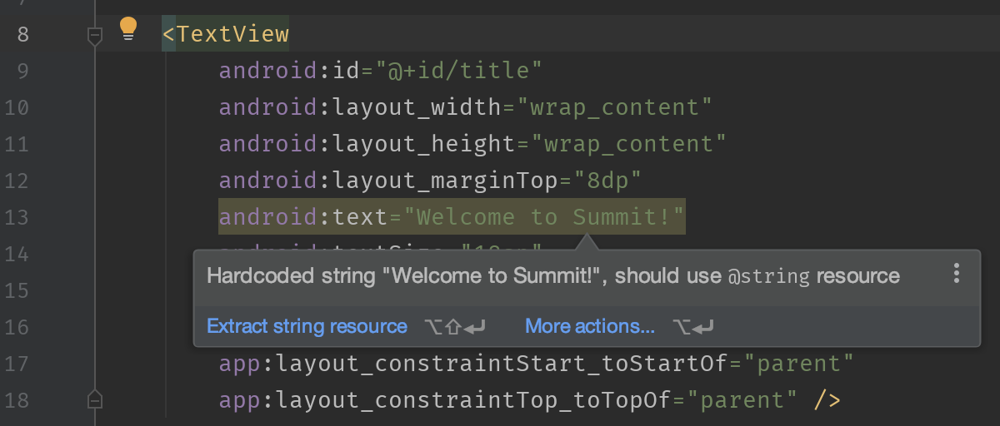
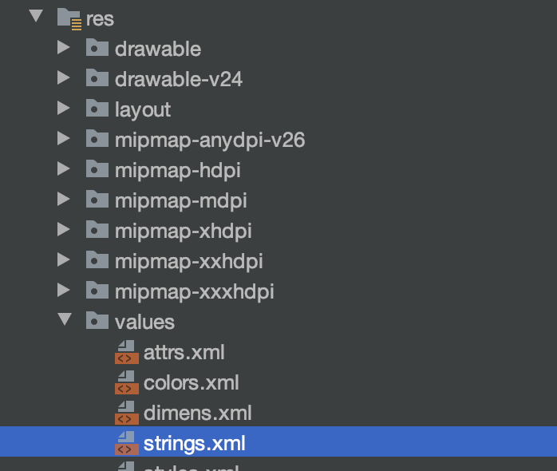
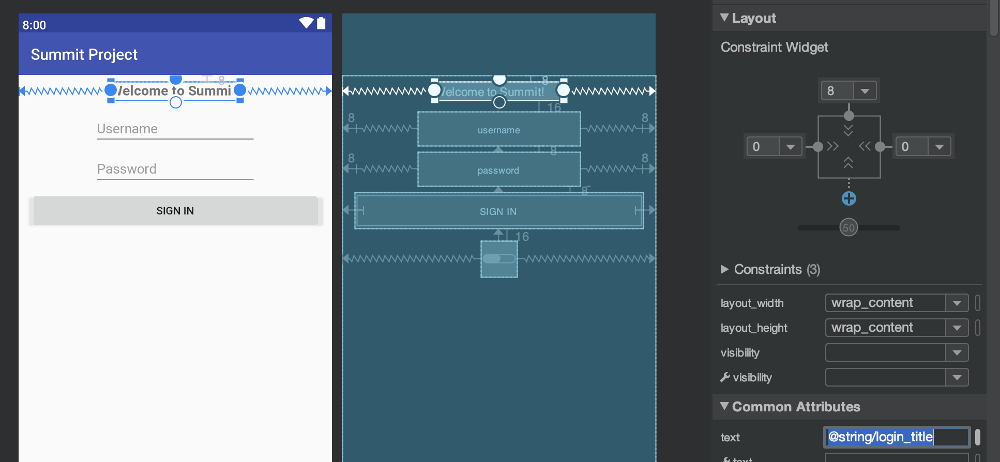
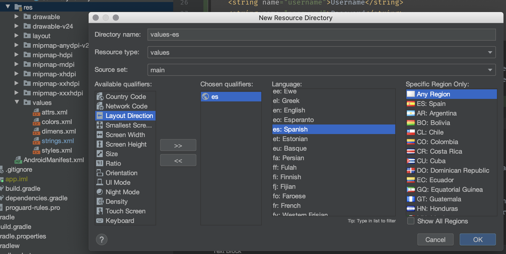
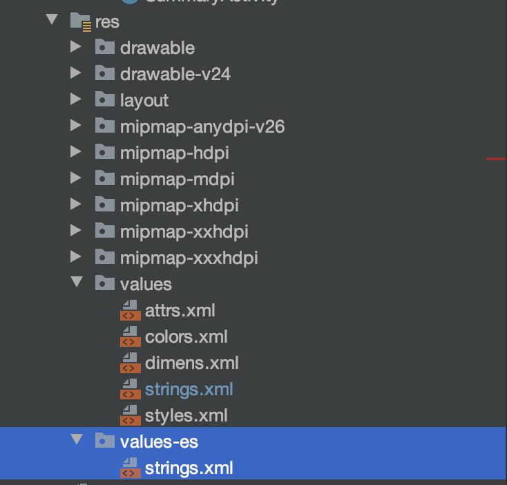
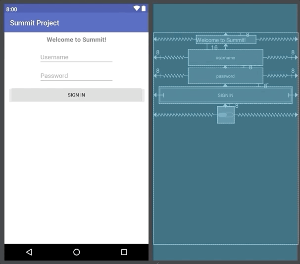

# Workshop Extras
This section covers some extra topics that I generally don't get to during the
live workshop, but generally interesting to talk about.

- [String Resources](#string-resources)
- [Login - Remember Me](#login---remember-me)
- [Transaction Click Listeners](#transaction-click-listeners)

## String Resources
When we built our Login UI, you might have noticed some warnings on our strings in XML:



The reason why hardcoded strings are "bad" is that it becomes harder to support other languages (localization / internationalization).
Our Login UI screen is basically "hardcoded" to English.

The recommended way to handle this in Android is by putting all of your (English) strings into its own XML file and reference
them from your layouts (similar to how you might reference variables in code). This allows you to provide alternate, translated strings in their
own files and swap them in-and-out based on the device's system language.

Our strings can be put into `app/src/main/res/values/strings.xml`:



And we would define them one-by-one with a `name` which acts as an ID:
```xml
<resources>
    <string name="app_name">Summit Project</string>
    <string name="login_title">Welcome to Summit!</string>
    <string name="username">Username</string>
    <string name="password">Password</string>
    <string name="sign_in">Sign In</string>
</resources>
```

And in our `activity_login.xml`, instead of hardcoding the string, we hardcode the _reference_ with `@string/string_id`. For example,
for your title `TextView`, we would use `@string/login_title` for the `text` attribute.



If we wanted to support other languages, like Spanish, we'd create a separate `values` folder (e.g. `values-es`).





This new folder would contain a separate `strings.xml` file with the translations.
Android will load the Spanish resources automatically at runtime if the device's language is set to Spanish.

The same `name`s are used, so the `@string` references don't changes, just the values.

```xml
<resources>
    <!-- Please excuse Google Translate for any mistakes -->
    <string name="app_name">Proyecto Cumbre</string>
    <string name="login_title">¡Bienvenido a Summit!</string>
    <string name="username">Nombre de Usuario</string>
    <string name="password">Contraseña</string>
    <string name="sign_in">Iniciar Sesión</string>
</resources>
```

## Login - Remember Me
We can see what simple data storage looks like in Android by adding a
"Remember Me" switch to save the username and password.

We first need to update the UI and place a `CheckBox` component to the left of our
Sign In button. We'd also like our `CheckBox` to be vertically centered in respect to the button, which is taller.

First, delete the left constraint from our Sign In button.



Place a `CheckBox` component (under `Buttons` in the palette) Constrain its left side to the left of the screen. Constraint
its top & bottom to the top & bottom anchors of the Sign In button, respectively, to get it to vertically center between the button.


Set the left constraint of the Sign In button to the right anchor of the `CheckBox`.
- Also set its left margin to 16


Finally, set some attributes on the `CheckBox`:
- Set the left margin to 16
- Set the `id` to `remember_me`

In `LoginActivity`, we also need to declare and initialize this new `CheckBox` variable:
```java
    ...
    
    private CheckBox rememberMe;

    @Override
    public void onCreate(Bundle savedInstanceState) {
        super.onCreate(savedInstanceState);
        setContentView(R.layout.activity_login);

        ...
        
        rememberMe = findViewById(R.id.remember_me);
```

If Remember Me is checked and the user signs in successfully, we want to save the username and password to a file so that
we can restore it upon the next launch of the app.

This is a pretty common use case in Android (simple offline storage), that there's a class built around it called `SharedPreferences`
to do the File I/O under-the-hood.

We can create a new instance of `SharedPreferences` in `onCreate` by calling `getSharedPreferences`. The two parameters
are the name of the "file" and the file creation mode (set to private, only readable / writable by our app).
```java
    private SharedPreferences sharedPreferences;

    @Override
    public void onCreate(Bundle savedInstanceState) {
        super.onCreate(savedInstanceState);
        setContentView(R.layout.activity_login);

        sharedPreferences = getSharedPreferences("prefs", Context.MODE_PRIVATE);
```

`SharedPreferences` is used to read / write simple data values to a file on the phone's SD card. It uses simple
key-value pairs (like a `Map`) to store data.

We can write a method `saveUserCredentials` to save the username / password to file:
```java
    private void saveUserCredentials() {
        SharedPreferences.Editor editor = sharedPreferences.edit();
        editor.putString("username", username.getText().toString());
        editor.putString("password", password.getText().toString());
        editor.apply();
    }
```
**Note:** you should never store user credentials in plaintext (e.g. encrypt them!) since this data could still be accessed (or stolen)
on a rooted phone by other root-level apps.

We can also write the reverse `restoreUserCredentials` to restore the username / password and pre-fill our `EditText`s. We also
need to "restore" the state of the `CheckBox` (was it checked or not):
```java
    private void restoreUserCredentials() {
        rememberMe.setChecked(sharedPreferences.contains("username"));
        username.setText(sharedPreferences.getString("username", ""));
        password.setText(sharedPreferences.getString("password", ""));
    }
```

We also need a `clearUserCredentials` if the user does not want the data stored any longer:
```java
    private void clearUserCredentials() {
        sharedPreferences.edit().clear().apply();
    }
```

All that's left is to call these new methods. We should call `restoreUserCredentials` in `onCreate` and `saveUserCredentials` in
our `LoginListener`'s `onLoginSuccess` _if_ the `CheckBox` is checked.

We would call `clearUserCredentials` if the user deselects the `CheckBox`, which we can achieve by setting a click listener on it.

You can see all of this in the [completed project's LoginActivity](https://github.com/nickcapurso/SE-Summit-Android-Workshop/blob/master/workshop-completed/app/src/main/java/com/summit/summitproject/LoginActivity.java).

## Transaction Click Listeners
For our `RecyclerView`, we might want the app to "react" when the user taps on a particular transaction. For example, tapping
on a transaction could open up a third `Activity` to show additional details.

There are a few ways we could do this. One way is to define our own `TransactionClickedListener` with one function
`onTransactionClicked` which will be invoked when a particular `Transaction` is clicked:
```java
    public interface TransactionClickedListener {
        void onTransactionClicked(Transaction transaction);
    }
```

Then, we could accept this listener in our `TransactionAdapter`'s constructor:
```java
    private TransactionClickedListener listener;

    public TransactionAdapter(List<Transaction> transactions, TransactionClickedListener listener) {
        this.transactions = transactions;
        this.listener = listener;
    }
```

And invoke the listener when the user taps on the row (specifically, the raised "card" that serves as the background):
```java
    @Override
    public void onBindViewHolder(@NonNull final ViewHolder holder, int position) {
        Transaction current = transactions.get(position);
        holder.merchant.setText(current.getMerchant());
        holder.amount.setText(current.getAmount());
        holder.cardView.setOnClickListener(new View.OnClickListener() {
            @Override
            public void onClick(View v) {
                // Inform the click listener that this row was clicked and pass the Transaction
                // associated with this row.
                if (listener != null) {
                    listener.onTransactionClicked(transactions.get(holder.getAdapterPosition()));
                }
            }
        });
    }
```

The `SummaryActivity` could implement this callback by showing a `Toast` (or launching a new `Activity):
```java
public class SummaryActivity extends AppCompatActivity implements TransactionAdapter.TransactionClickedListener {
    // ...
    
    @Override
    public void onTransactionClicked(Transaction transaction) {
        Toast.makeText(this, getString(R.string.transaction_selected, transaction.getMerchant()), Toast.LENGTH_LONG).show();
    }
}
```

You can see all of this in the [completed project's SummaryActivity](https://github.com/nickcapurso/SE-Summit-Android-Workshop/blob/master/workshop-completed/app/src/main/java/com/summit/summitproject/SummaryActivity.java)
and [TransactionAdapter](https://github.com/nickcapurso/SE-Summit-Android-Workshop/blob/master/workshop-completed/app/src/main/java/com/summit/summitproject/prebuilt/model/TransactionAdapter.java).

[Back to Index](../README.md)